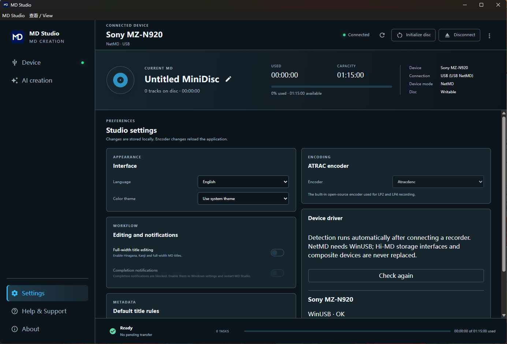

# MD Studio — AI とつくる MD

[English](README.md) · [简体中文](README.zh-CN.md) · [日本語](README.ja.md)

**MD 作成で手間のかかる曲名入力を AI に。日本語の読み方、曲順、グループまでまとめて整理できます。** MD Studio は、NetMD・Hi-MD を使って音楽を録音する無料のオープンソース Windows アプリです。手動操作に加え、MCP または付属 CLI から AI アシスタントと連携できます。

**[Windows 版をダウンロード](https://github.com/lindelin/md-studio/releases/latest)** · **[日本語マニュアル](docs/manual/ja.md)** · **[不具合を報告](https://github.com/lindelin/md-studio/issues)**

初回起動時はシステム言語に従い、設定から日本語・English・简体中文を切り替えられます。

## 音楽フォルダーから、お気に入りの MD へ

1. MD Studio をインストールし、レコーダーを USB で接続。
2. 音楽ファイルを追加して録音モードを選択。
3. AI にタイトル・読み方・グループを整理してもらうか、自分で編集。
4. 曲順・タイトル・残り容量を確認して録音。

> 「C:/Music/Album のアルバムを LP2 で MD にしたい。通常タイトルは半角カタカナ、全角タイトルは元の日本語にして、アルバムごとにグループ分け。書き込む前にプランを見せて。」

## MD 制作に必要な機能をひとつに

- **AI によるタグ整理：** 付属の MD タグ整理 Skill が、英語・日本語のタイトル、欠けたタグ、読み方、グループの整理を案内します。不確かな読み方は確認してから使えます。
- **NetMD・Hi-MD 対応：** 実績のある機器ライブラリを使用。利用できる機能やモードは機器とディスクに依存します。
- **わかりやすい録音表示：** 対応機器では SP・LP2・LP4・MONO を選択でき、容量の確認と進捗表示も可能。
- **同じ状態を共有：** 画面、CLI、MCP が同じ機器・取り込みキュー・タスクを操作します。
- **MCP の設定は一度だけ：** 再起動しても接続 URL は維持。ウィンドウを閉じてもトレイで動作を続けます。
- **日本語・英語・中国語：** 設定で言語とライト／ダークテーマを切り替えられます。
- **音声処理はローカル：** デコード、変換、USB 転送はパソコン上で実行。音声処理用サーバーは不要です。

## 必要なもの

Windows 10/11（64 ビット）、対応する USB レコーダー、書き込み可能な MD、安定した電源をご用意ください。

AI 連携には、ローカル HTTP MCP またはローカル CLI の実行に対応する、ご自身の AI クライアントが必要です。AI モデルやサブスクリプションは付属しません。クラウド上のサーバーにしか接続できないクライアントから localhost へ直接接続することはできません。

**ソースコードのダウンロードや Node.js のインストールは不要です。** 通常の録音に必要なエンコーダーも同梱しています。WinUSB が必要な場合は、設定から検証済みの Zadig インストーラーを開けます。

現在のインストーラーには Windows コード署名がありません。本リポジトリの Releases から入手し、公開された SHA-256 と照合してください。Sony MZ-N920 で実機確認済みですが、すべての機種での動作を検証したものではありません。

## AI 接続とプライバシー

**AI 制作** で MCP を有効にし、ローカル URL 全体をクライアントに登録して、付属 Skill をエクスポート・インストールします。URL にはアクセスキーが含まれるため、共有しないでください。AI を使わずに編集・録音することもできます。

音声変換と機器通信はローカルで処理します。AI クライアントは、その設定に従って会話やタグ情報を提供元へ送信する場合があります。録音が完了するまで電源と USB を維持してください。バッチの終了操作は、録音中の曲が安全に完了するまで待機します。

接続、タイトルの規則、グループ、CLI、トラブル対処は[日本語マニュアル](docs/manual/ja.md)をご覧ください。

## ライセンスと謝辞

[Web MiniDisc Pro](https://github.com/asivery/webminidisc) を基に開発しています。asivery 氏と NetMD・Hi-MD コミュニティに感謝します。[GPL-2.0-only](LICENSE) で公開し、[クレジット](NOTICE.md)と[第三者ライセンス](THIRD_PARTY_LICENSES.md)を保持しています。[開発への参加](CONTRIBUTING.md)も歓迎します。MiniDisc および機器名は各権利者に帰属します。本プロジェクトは独立したコミュニティプロジェクトです。
